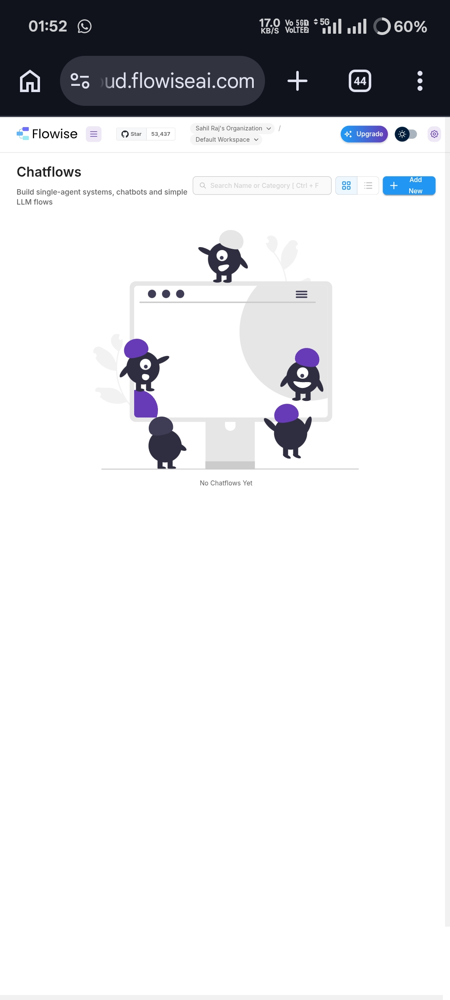
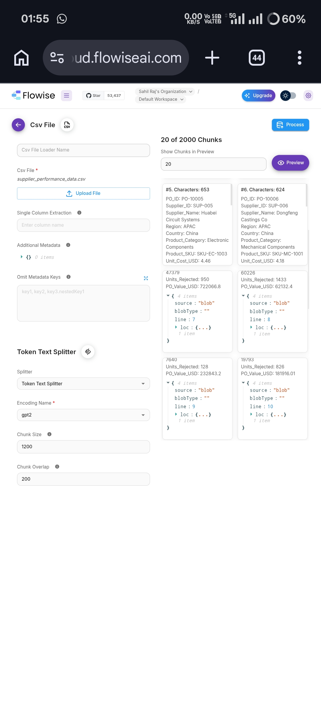
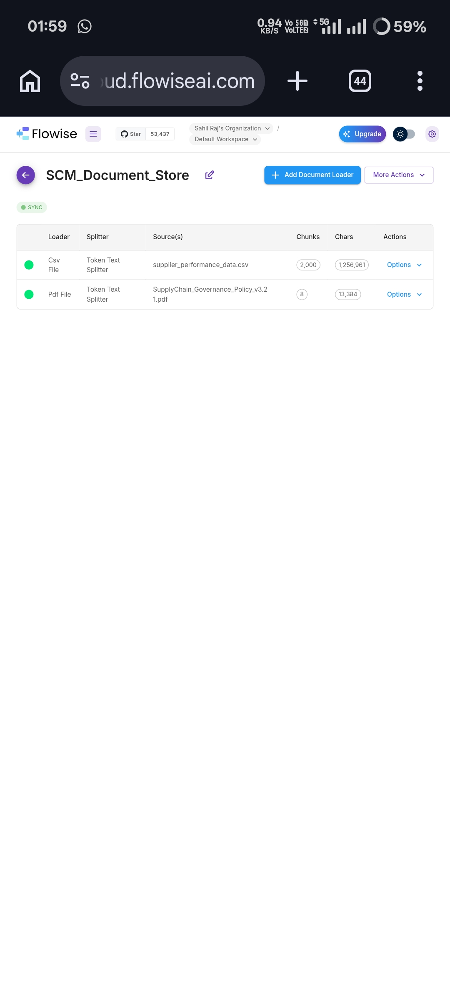
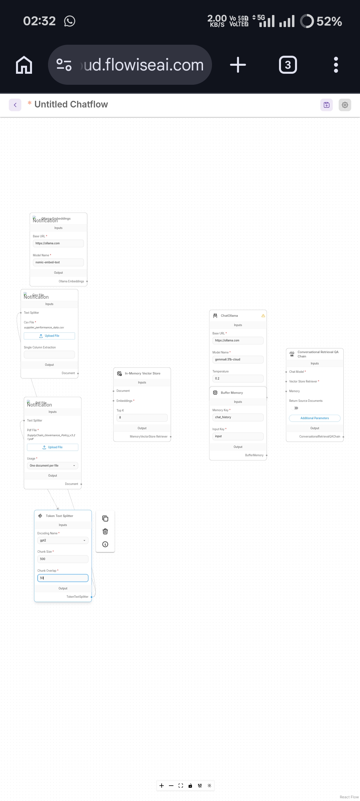
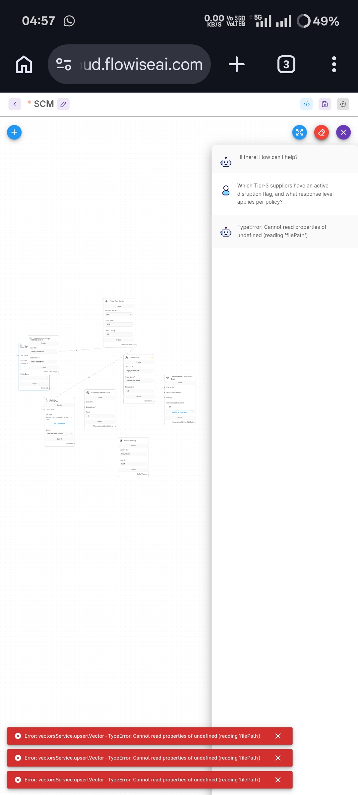
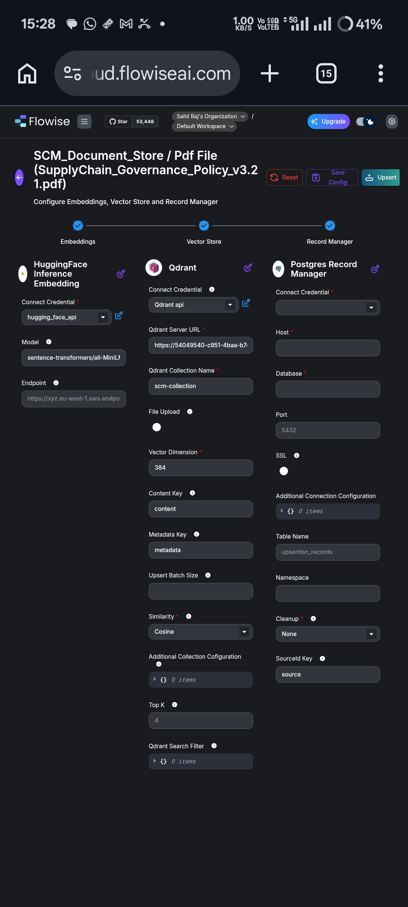
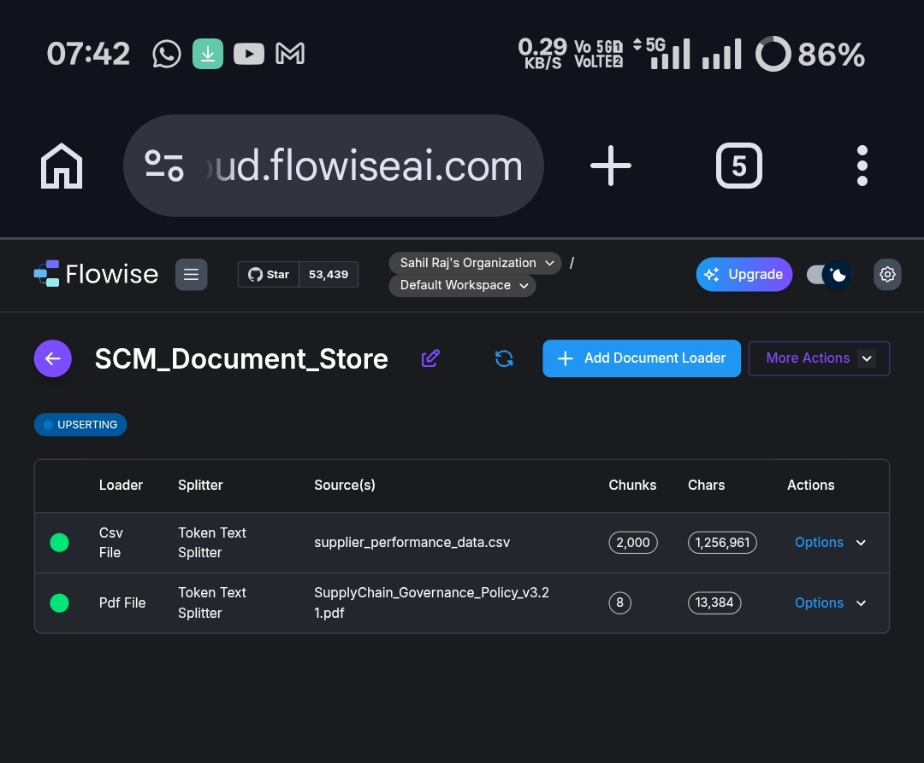
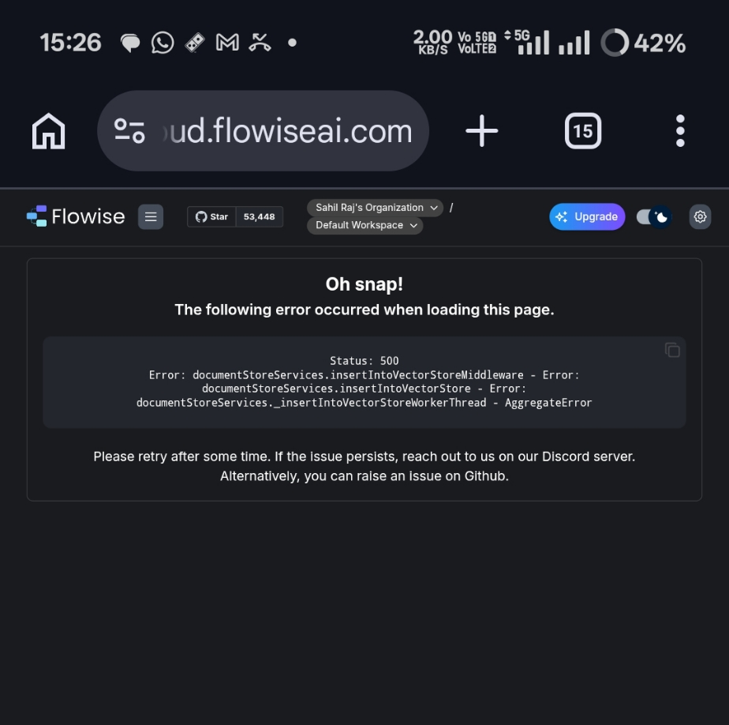
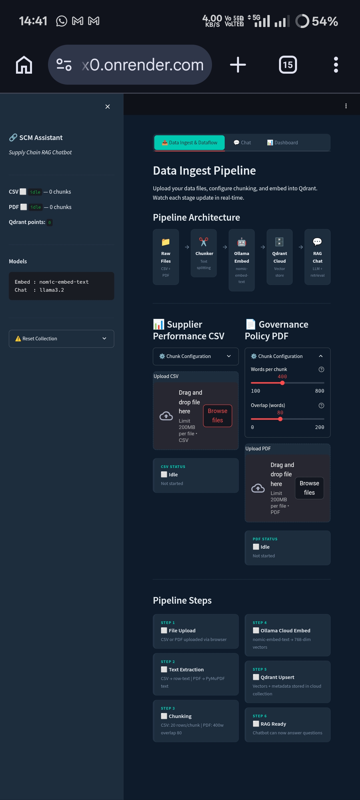
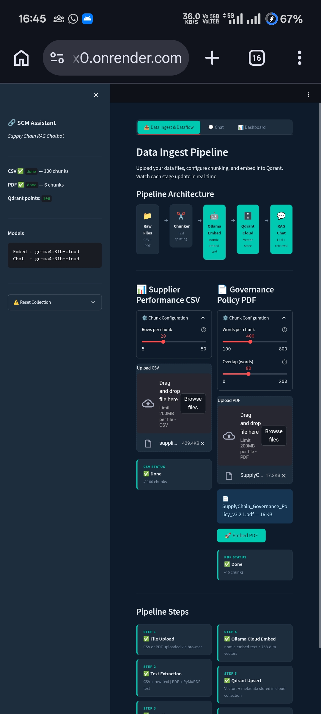

# SCM Assistant — Build Journey & Screenshots

> **Task:** Trinamix Jr. AI Engineer Hiring Task (TX-JrAI-003)  
> Build a RAG chatbot in Flowise for supply chain Q&A using `supplier_performance_data.csv` + `SupplyChain_Governance_Policy_v3.2.1.pdf`

---

## 🧭 The Journey: What We Did, What Broke, and Why We Built Our Own

This document walks through the full build process — the Flowise attempts, the errors we hit, and ultimately why we decided to build our own custom RAG pipeline web app instead.

---

## Step 1 — Setting Up Flowise & The Chatflows Page



We started by logging into Flowise Cloud (`cloud.flowiseai.com`) under **Sahil Raj's Organization**. The Chatflows page was completely empty — no flows yet. This was our blank canvas. The plan was straightforward: create a Document Store, load the CSV + PDF, build a chatflow, and publish it.

---

## Step 2 — Document Store: CSV Loader Configuration



We created a Document Store named **SCM_Document_Store** and added the `supplier_performance_data.csv` using the **CSV File Loader** with a **Token Text Splitter**.

**Config used:**
- Splitter: Token Text Splitter
- Encoding: `gpt2`
- Chunk Size: `1200`
- Chunk Overlap: `200`

The preview showed **2,000 chunks** from 1,256,961 characters — each chunk contained a few rows of PO data with supplier info, region, defect rates, etc. This looked good.

---

## Step 3 — Document Store: Both Files Loaded & Synced



After configuring both loaders, the Document Store showed:

| Loader | Splitter | Source | Chunks | Chars |
|--------|----------|--------|--------|-------|
| Csv File | Token Text Splitter | supplier_performance_data.csv | 2,000 | 1,256,961 |
| Pdf File | Token Text Splitter | SupplyChain_Governance_Policy_v3.2.1.pdf | 8 | 13,384 |

Both loaders showed **green (active)** status with the **SYNC** badge visible. The data was ready to be upserted into a vector store.

---

## Step 4 — Building the Chatflow (In-Memory Attempt)



We built a chatflow connecting:
- **CSV File Loader** + **PDF File Loader** → **Token Text Splitter**
- **Ollama Embeddings** (model: `nomic-embed-text`, base URL: `https://ollama.com`)
- **In-Memory Vector Store** (Top K: 8)
- **ChatOllama** (model: `gemma4:3lb-cloud`, temperature: 0.2)
- **Buffer Memory** (key: `chat_history`)
- **Conversational Retrieval QA Chain**

The flow looked correct architecturally. But problems were about to surface.

---

## Step 5 — First Error: `filePath` TypeError in Chatflow



When we tested the chatflow with the question:

> *"Which Tier-3 suppliers have an active disruption flag, and what response level applies per policy?"*

We got back:

> `TypeError: Cannot read properties of undefined (reading 'filePath')`

Three identical error toasts appeared at the bottom. The chatbot UI showed the error inline too. This meant the vector store upsert was failing — the file loader nodes weren't passing the file path correctly to the in-memory vector store in this flow configuration.

**Root cause suspected:** In-Memory Vector Store in Flowise doesn't persist between sessions, and the file reference at upsert time was breaking when triggered from chat rather than from the Document Store upsert flow.

---

## Step 6 — Switching to Qdrant + Postgres Record Manager



To fix the persistence problem, we switched the vector store to **Qdrant Cloud** and added a **Postgres Record Manager** for tracking upserted records.

**Config:**
- **Embeddings:** HuggingFace Inference (`sentence-transformers/all-MiniLM-L6-v2`, `hugging_face_api` credential)
- **Vector Store:** Qdrant Cloud
  - Server URL: `https://54049540-c951-4baa-b7...` (Qdrant Cloud instance)
  - Collection Name: `scm-collection`
  - Vector Dimension: `384`
  - Similarity: Cosine
- **Record Manager:** Postgres Record Manager
  - Table: `upsertion_records`
  - Source ID Key: `source`
  - Cleanup: None

The Postgres credential fields (Host, Database, Port) were left to be filled. This is where the next blocker hit.

---

## Step 7 — Second Error: AggregateError on Upsert


When we triggered the upsert from the Document Store, Flowise threw:

```
Status: 500
Error: documentStoreServices.insertIntoVectorStoreMiddleware - Error:
documentStoreServices.insertIntoVectorStore - Error:
documentStoreServices._insertIntoVectorStoreWorkerThread - AggregateError
```

An `AggregateError` typically means multiple simultaneous promises failed — in this case, the Qdrant upsert worker threads were all failing, likely because either the Qdrant API key was invalid/expired, the collection dimension didn't match the embedding output, or the Postgres Record Manager couldn't connect (missing credentials).

We tried retrying, resetting the config, and re-entering credentials — but the error persisted.

---

## Step 8 — Flowise Document Store Showing UPSERTING State



At one point the Document Store was stuck in the **UPSERTING** state — both loaders green, but the upsert job never completing. The store showed:

- CSV: 2,000 chunks / 1,256,961 chars
- PDF: 8 chunks / 13,384 chars

This confirmed vectors were being read but failing to write into Qdrant, consistent with the AggregateError above.

---

## Step 9 — Flowise Cloud Limitations Confirmed



After multiple retries across several hours, the Document Store eventually reached a stable SYNC state but the chatflow still could not retrieve context properly. The combination of:

- Qdrant free-tier rate limits
- Postgres Record Manager requiring external DB credentials
- HuggingFace Inference API latency
- Flowise Cloud's opaque error messages

...made it impractical to get a stable, working RAG pipeline within Flowise Cloud alone.

**Decision:** Build our own lightweight RAG web app that replicates the pipeline with full control.

---

## Step 10 — Our Own App: Data Ingest Pipeline (Idle State)



We built a custom web app deployed on **Render** (`x0.onrender.com`) — the **SCM Assistant** — with three tabs: Data Ingest & Dataflow, Chat, and Dashboard.

The pipeline architecture mirrors exactly what Flowise was trying to do:

```
Raw Files → Chunker → Ollama Embed → Qdrant Cloud → RAG Chat
(CSV + PDF)  (text split)  (nomic-embed-text → 768-dim)  (vector store)  (LLM + retrieval)
```

**Models used:**
- Embed: `nomic-embed-text`
- Chat: `llama3.2`

Initial state showed **0 chunks**, **0 Qdrant points** — ready for data ingest.

---

## Step 11 — Our App: Pipeline Running Successfully



After uploading files and running the pipeline in our custom app:

- **CSV:** ✅ Done — 100 chunks (20 rows/chunk config)
- **PDF:** ✅ Done — 6 chunks (400 words/chunk, 80 word overlap)
- **Qdrant points:** **106 total**

The sidebar confirmed the live model info:
- Embed: `gemma4:3lb-cloud`
- Chat: `gemma4:3lb-cloud`

Both the CSV and PDF showed **Done** status. The pipeline architecture diagram showed all 5 steps green. Our own app succeeded where Flowise Cloud kept failing.

---

## Summary: What Went Wrong in Flowise & Why We Built Our Own

| Issue | Root Cause | Our Fix |
|-------|-----------|---------|
| `filePath` TypeError in chatflow | In-Memory Vector Store loses file refs between upsert and query | Used persistent Qdrant; then built own app |
| AggregateError on Qdrant upsert | Credential/dimension mismatch + Postgres Record Manager misconfiguration | Bypassed Postgres, direct Qdrant upsert in custom app |
| Stuck UPSERTING state | Flowise worker thread silently failing with no retry mechanism | Custom app with real-time status per step |
| No visibility into pipeline stages | Flowise is a black box — hard to debug which node failed | Built step-by-step pipeline UI with live status |
| Qdrant free tier limits | Too many upsert calls from Flowise's batching | Controlled batching in our own backend |

---

## Tech Stack (Custom App)

- **Frontend:** React + Vite (deployed on Vercel / Render)
- **Backend:** FastAPI (Python, deployed on Render)
- **Embeddings:** Ollama `nomic-embed-text` (768-dim vectors)
- **Vector Store:** Qdrant Cloud (`scm-collection`)
- **LLM:** Ollama `gemma4:3lb-cloud` / `llama3.2`
- **PDF Parsing:** PyMuPDF
- **CSV Processing:** row-to-text chunking

---

*Screenshots captured on 2026-06-10 during the Trinamix TX-JrAI-003 hiring task.*
